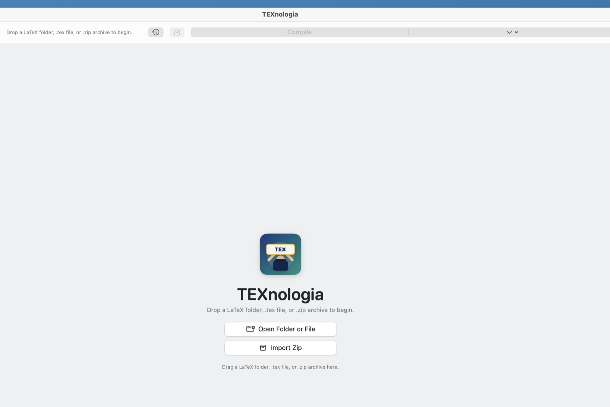

# TEXnologia

TEXnologia is a macOS-native LaTeX writing IDE prototype focused on a fast research-writing loop:

open a project, edit `.tex`, build locally, jump to errors, and preview the PDF.

The current implementation is a Swift Package app using SwiftUI, AppKit, `NSTextView`, and PDFKit. It assumes a local TeX distribution such as MacTeX or BasicTeX is already installed.


## Screenshot



## Current Features

- LaTeX-aware source editor using AppKit `NSTextView`
- Syntax highlighting for commands, comments, braces, and math delimiters
- BibTeX syntax highlighting for entry types, citation keys, field names, values, comments, numbers, and punctuation
- Word-based wrapping with horizontal scrolling disabled
- English spelling/grammar checking while suppressing red underlines for TeX syntax ranges
- Folder, `.tex`, and `.zip` project opening
- Project explorer with rename, delete-to-trash confirmation, drag/drop, new file/folder, refresh, and Finder reveal
- PDF preview via PDFKit
- Image, PDF, JSON, source, and unknown-file routing so binary files are not opened as text
- Read-only, bounded previews for generated LaTeX text files such as `.log`, `.out`, `.aux`, and `.fls`
- Local LaTeX build through `latexmk` when available, with direct engine fallback
- `pdflatex`, `xelatex`, and `lualatex` support
- TeX Live year selection limited to `2024` and `2025`; default is `pdfLaTeX` with `2024`
- Compile process wrapper and issue parsing
- Collapsed issue dock by default, expandable when needed
- Preferences for engine, shell escape, theme, font, wrapping-related editor behavior, spell checking, and artifact visibility
- Generated build output under `.texnologia-build`
- Early Windows porting plan under `platforms/windows`

## Requirements

- macOS 14 or newer
- Xcode Command Line Tools or Xcode with Swift 5.9+
- MacTeX or BasicTeX
- `latexmk` recommended

Check Swift:

```bash
swift --version
```

Check TeX:

```bash
/usr/local/texlive/2024/bin/universal-darwin/pdflatex --version
/Library/TeX/texbin/latexmk --version
```

If `latexmk` is missing but `pdflatex`, `xelatex`, or `lualatex` exists, TEXnologia can still use the direct-engine fallback.
TEXnologia searches the selected TeX Live year first, then falls back to the active `/Library/TeX/texbin` symlink.

## Run In Development

From the repository root:

```bash
swift run TEXnologia
```

This launches the app directly from Swift Package Manager.

## Build A macOS App Bundle

```bash
scripts/build_app_bundle.sh
```

The generated app appears at:

```text
dist/TEXnologia.app
```

Open it:

```bash
open dist/TEXnologia.app
```

Optional: copy it to Applications after building:

```bash
cp -R dist/TEXnologia.app /Applications/
```

## Use The App

1. Launch TEXnologia.
2. Click `Open` to choose a LaTeX folder, a `.tex` file, or a `.zip` archive.
3. Select a `.tex` file in the explorer.
4. Edit in the center editor.
5. Press `Command-B` or click `Compile`.
6. Review issues in the bottom dock if the build fails.
7. Click an issue to jump to the source location.
8. Preview the generated PDF on the right.

Useful shortcuts:

| Shortcut | Action |
| --- | --- |
| `Command-O` | Open project, `.tex`, or `.zip` |
| `Shift-Command-O` | Import zip archive |
| `Command-S` | Save |
| `Command-B` | Compile |
| `Control-Command-F` | Toggle fullscreen |

## Preferences

Open the macOS app settings window to configure:

- Appearance: system, light, or dark
- Editor theme
- Editor font family and size
- Line spacing
- Spell checking
- Default TeX engine
- TeX Live year: `2024` or `2025`
- Shell escape
- Auto-build on save
- Intermediate artifact hiding

Shell escape is disabled by default.

## Compile Output

TEXnologia writes generated build files into:

```text
<project>/.texnologia-build/
```

The explorer hides this folder by default when intermediate artifact hiding is enabled.

## Validation

Run the core checks:

```bash
swift build
scripts/verify_feature_contracts.sh
scripts/verify_file_routing.sh
scripts/verify_bib_highlighting.sh
scripts/verify_editor_wrapping.sh
scripts/verify_app_icon_dimensions.sh
```

Run LaTeX smoke tests:

```bash
scripts/smoke_latex_build.sh
```

This uses fixture projects under `Tests/Fixtures/LaTeXProjects`:

- `001-basic-article`: expected success
- `012 path 한글 edge`: expected success with spaces and Korean path characters
- `007-invalid-syntax`: expected failure with a parsed LaTeX error

Run Windows port-readiness checks:

```bash
scripts/verify_windows_port_readiness.sh
```

## Windows Status

The current app target is macOS-only because it depends on SwiftUI, AppKit, PDFKit, and `NSTextView`.

Windows support should be implemented as a separate desktop host:

```text
platforms/windows/TEXnologia.Windows
```

Recommended Windows stack:

- .NET 8
- Avalonia
- WebView2
- Monaco editor
- pdf.js
- MiKTeX or TeX Live installed externally

See [docs/windows-support.md](docs/windows-support.md) for the porting plan.

## Repository Layout

```text
TEXnologia/
  App/                  # SwiftUI app shell and app model
  BuildSystem/          # LaTeX process execution and log parsing
  Core/                 # Shared domain models
  Editor/               # AppKit-backed LaTeX editor and syntax highlighter
  IssueNavigator/       # Compile issue dock
  PDFViewer/            # PDFKit integration
  Preferences/          # User settings UI and persistence
  ProjectIndexing/      # File tree, outline, labels, citations
  Resources/            # App icon source
docs/                   # Product, architecture, QA, and porting docs
platforms/windows/      # Windows host planning scaffold
scripts/                # Build and verification scripts
Tests/Fixtures/         # LaTeX regression fixtures
```

## Notes

This project is independent and does not copy the branding, UI design, icons, proprietary names, or proprietary implementation of any existing LaTeX editor. It references the broad functional category of professional LaTeX writing tools while defining its own product direction and implementation.
