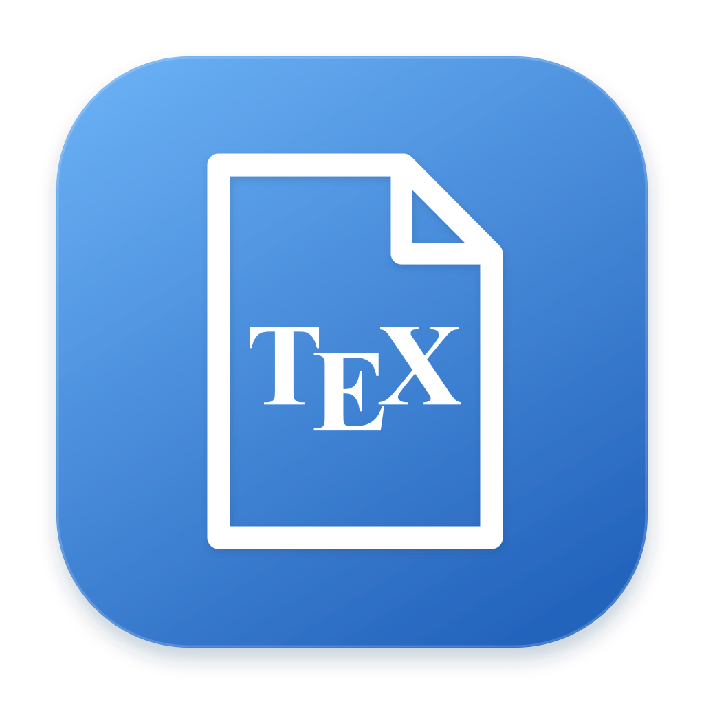
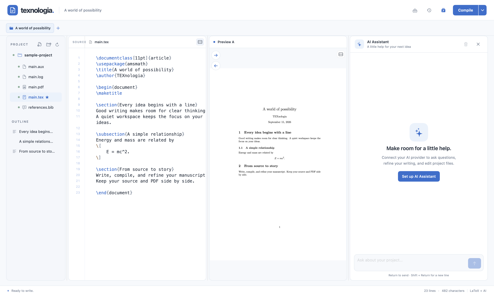
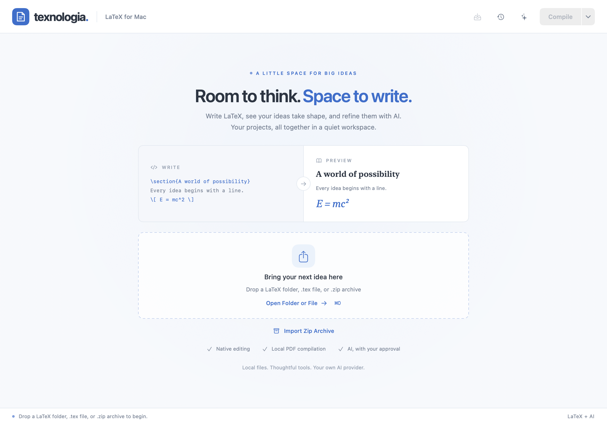
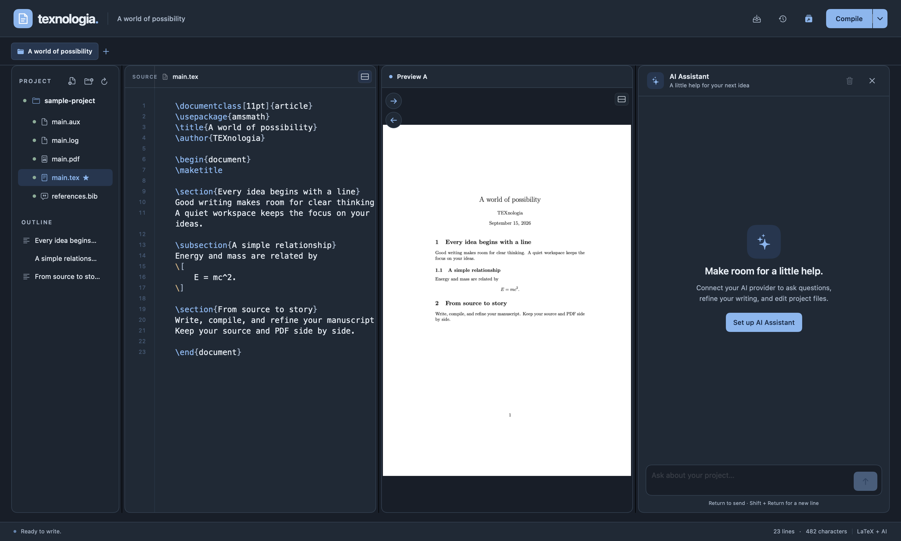

# TEXnologia



**A macOS-native LaTeX IDE with AI built in. Bring your own API key.**

Write LaTeX in a fast native editor, compile locally, preview the PDF, and let the AI assistant revise your manuscript through an inline diff you control. Every provider you care about — Anthropic, OpenAI, Gemini, Grok, DeepSeek, Mistral, Groq, or local Ollama — just paste your token.





## Design

The interface follows Folio's visual language with TEXnologia's blue palette: a blue folded-page icon, light surfaces, fine borders, and a quieter writing workspace. The welcome screen, project explorer, source editor, PDF preview, AI assistant, revision review, history, and preferences share one adaptive light/dark palette. Editing, compilation, keyboard shortcuts, settings, and project storage retain their existing behavior.

## Why

Most LaTeX tools are either cloud SaaS (ongoing fees, your drafts on someone else's server) or unmaintained native editors that haven't caught up to how you actually write in 2025. TEXnologia is what we'd have wanted in one place:

- **A real native editor.** AppKit text view, syntax highlighting, find, word wrapping, line commands. No Electron.
- **Local compiles.** pdflatex / xelatex / lualatex with automatic bibtex **and** biber.
- **AI assistance that stays in your hands.** Bring your own API key. Proposals come back as a reviewable diff — accept a hunk, edit it first, or reject it. Never surprise rewrites.
- **A proper history with TeXdiff export.** Review per-file changes, pick any snapshot as your base, export `\DIFadd` / `\DIFdel` markup for revisions.
- **SyncTeX jumps.** One button jumps between the editor caret and the PDF.
- **Your files stay on disk.** No sync service, no account, no telemetry.

## What you get

- LaTeX editor with command / comment / brace / math highlighting, citation commands in their own color, multi-tab, multi-session workspaces.
- Local compile via `latexmk` when available, direct engine otherwise. Detects biblatex (`.bcf`) and runs biber automatically.
- AI pane with tool use: read files, propose edits, insert content. Every proposal is a staged diff with Accept / Use AI / Reset / Reject per hunk.
- Per-file snapshot history. Pick any snapshot as your base and diff everything against it. Export TeXdiff.
- PDF preview (single or split), inline error navigation, project explorer with drag/drop, rename, Finder reveal, external-change watcher.
- Keyboard shortcuts for every common editor operation (find, toggle comment, move line, duplicate/delete line, select line, font size).

## Quick start

```bash
# Build the .app bundle.
./scripts/build_app_bundle.sh

# Launch.
open dist/TEXnologia.app
```

Drop a project folder, `.tex` file, or `.bib` file onto the welcome screen, or press `Cmd+O` to open one. The app bundle supports opening `.tex` and `.bib` documents from Finder; files belonging to an open project reuse its session and preserve unsaved edits.

Press `Cmd+S` to save and compile, regardless of the Save button preference. During a build, a spinning indicator and “컴파일 중” label appear beside Compile. Saving again queues one follow-up build with the latest saved changes.

Status messages disappear after five seconds; each new message restarts the timer. Use the arrows between the source editor and preview to navigate a compiled document: **→** finds the PDF location for the editor cursor, and **←** finds the source for the last point clicked in the focused PDF preview. This requires SyncTeX from your TeX installation and a PDF compiled with SyncTeX enabled.

Requires **macOS 14+**, a TeX Live install (MacTeX or BasicTeX — biber and latexmk recommended), and Swift 5.9+ for building from source.

## Using AI

Open **Settings → AI**, pick a provider, paste your API key, hit save. That's it — the assistant can now read your project and propose edits.

Supported providers out of the box:
- **Anthropic** (Claude Opus / Sonnet / Haiku)
- **OpenAI** (GPT-5, o-series, Codex — Pro and Codex route through the Responses API automatically)
- **Google** (Gemini)
- **xAI** (Grok)
- **DeepSeek**, **Mistral**, **Groq**
- **Ollama** (local, no key required)

Proposed edits never touch your buffer directly. They're staged as an inline diff. You'll see the AI suggestion (read-only, copyable) alongside your editable version — tweak before accepting.

## Shortcuts

| Shortcut | Action |
| --- | --- |
| `Cmd-O` / `Shift-Cmd-O` | Open project / import .zip |
| `Cmd-S` | Save and compile |
| `Cmd-B` | Compile (saves the current source first) |
| `Cmd-F` | Find |
| `Cmd-/` | Toggle line comment |
| `Cmd-L` | Select line |
| `Shift-Cmd-D` | Duplicate line |
| `Shift-Cmd-K` | Delete line |
| `Option-Up/Down` | Move line up/down |
| `Cmd-=` / `Cmd--` / `Cmd-0` | Editor font bigger / smaller / reset |
| `Ctrl-Cmd-F` | Toggle fullscreen |

## Compile output

Build artifacts live under `<project>/.texnologia-build/`. The project explorer hides it by default (toggleable in Settings).

Shell escape is off by default. Enable it per project under **Settings → Compile** if you need shell-escape packages.

## Build from source

```bash
swift run TEXnologia              # run in development
./scripts/build_app_bundle.sh     # produce dist/TEXnologia.app
./.build/debug/TEXnologia --run-tests   # run the internal test suite
python3 scripts/verify_compile_workflow.py --real-tex  # isolated save/build/PDF checks
```

The test suite runs entirely in-process (no XCTest dependency) and currently covers 230+ cases across history diff logic, SyncTeX parsing, math-hover detection, and line/column computation.

## Repository layout

```
TEXnologia/
  App/              SwiftUI app shell, AppModel, session persistence
  BuildSystem/      latex / bibtex / biber / synctex wrappers
  Chat/             AI client, tools, pending-edit review UI
  Core/             Shared domain models
  Editor/           NSTextView-backed editor, syntax highlighter, math detector
  History/          Per-file history, diff engine, TeXdiff export
  IssueNavigator/   Compile issue dock
  PDFViewer/        PDFKit integration
  Preferences/      Settings UI & persistence
  ProjectIndexing/  Project explorer, outline, indexer
  Tests/            In-process test runner
platforms/windows/  Porting scaffold
scripts/            Build and verification scripts
```

## Notes

Independent LaTeX editor. The visual design and folded-page icon are adapted from this author's Folio project; the application name, native Swift architecture, and existing LaTeX workflow remain TEXnologia.
