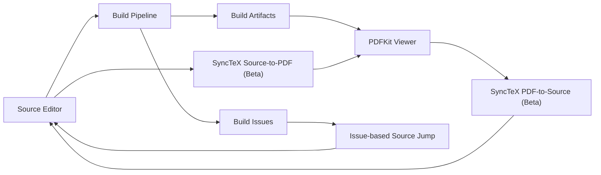

# Subagent 6: PDF Viewer and SyncTeX Agent

## 목표

PDFKit 기반 integrated PDF viewer를 앱 내부에 제공한다. MVP는 빌드 완료 후 PDF 자동 reload, 현재 page/zoom 유지, dark mode 대응, build issue에서 source 위치로 점프하는 흐름까지 포함한다. SyncTeX 기반 source-to-PDF 및 PDF-to-source navigation은 Beta 기능으로 설계하고, MVP 이후 안정화 단계에서 활성화한다.

## 범위

### MVP

- PDFKit 기반 내장 PDF viewer component
- LaTeX build 성공 후 output PDF reload
- reload 전후 current page, zoom, scroll anchor 유지
- PDF 파일 변경/교체 중에도 viewer crash 또는 빈 화면을 최소화하는 reload strategy
- macOS dark mode에서 viewer chrome/background가 자연스럽게 보이도록 처리
- build issue 클릭 시 source editor로 이동
- PDF 문서/빌드 산출물/issue/source location을 연결하는 synchronization data model

### Beta

- SyncTeX source-to-PDF navigation
- SyncTeX PDF-to-source navigation
- PDF 좌표계와 editor 위치 간 매핑
- `.synctex.gz` 생성 여부, TeX 엔진 차이, included file path resolution에 대한 진단 UI

## 아키텍처 개요



핵심 원칙은 viewer와 editor가 서로를 직접 강하게 참조하지 않고, `PDFSyncCoordinator`가 중간에서 document state, source location, PDF destination, build artifacts를 조정하는 것이다.

## PDF Viewer Component 설계

### Component 구성

- `PDFViewerContainer`
  - SwiftUI entry component
  - toolbar, page indicator, zoom controls, loading/error state 표시
  - `PDFViewerState`와 `PDFDocumentDescriptor`를 binding으로 받음

- `PDFKitView`
  - `NSViewRepresentable`
  - 내부에 `PDFView` 생성
  - `PDFKitCoordinator`가 PDFView delegate, notification, state capture 담당

- `PDFViewerModel`
  - 현재 문서 URL, reload token, loading state, error state 관리
  - build artifact update 이벤트를 받아 viewer reload 요청

- `PDFSyncCoordinator`
  - issue-based source jump
  - SyncTeX Beta command 실행 및 결과 파싱
  - source/PDF synchronization data model의 단일 진입점

### Viewer State

`PDFView`는 reload 시 `PDFDocument`가 교체되면 현재 page와 zoom을 잃기 쉽다. 따라서 reload 직전에 view state를 캡처하고, 새 document 로드 직후 복원한다.

```swift
struct PDFViewerState: Equatable, Codable {
    var documentID: String
    var pageIndex: Int
    var pageLabel: String?
    var scaleFactor: CGFloat
    var autoScales: Bool
    var displayMode: PDFViewerDisplayMode
    var displayDirection: PDFViewerDisplayDirection
    var normalizedVisibleRect: CGRect
}

enum PDFViewerDisplayMode: String, Codable {
    case singlePage
    case singlePageContinuous
    case twoUp
    case twoUpContinuous

    var pdfKitValue: PDFDisplayMode {
        switch self {
        case .singlePage: return .singlePage
        case .singlePageContinuous: return .singlePageContinuous
        case .twoUp: return .twoUp
        case .twoUpContinuous: return .twoUpContinuous
        }
    }

    init(_ value: PDFDisplayMode) {
        switch value {
        case .singlePage: self = .singlePage
        case .twoUp: self = .twoUp
        case .twoUpContinuous: self = .twoUpContinuous
        default: self = .singlePageContinuous
        }
    }
}

enum PDFViewerDisplayDirection: String, Codable {
    case vertical
    case horizontal

    var pdfKitValue: PDFDisplayDirection {
        self == .horizontal ? .horizontal : .vertical
    }

    init(_ value: PDFDisplayDirection) {
        self = value == .horizontal ? .horizontal : .vertical
    }
}
```

`normalizedVisibleRect`는 현재 page bounds 대비 visible rect를 0...1 좌표로 저장한다. PDF rebuild 후 page 크기가 조금 바뀌어도 scroll 위치를 최대한 유사하게 복원할 수 있다.

### PDFKit Integration Skeleton

```swift
import SwiftUI
import PDFKit

struct PDFViewerContainer: View {
    @ObservedObject var model: PDFViewerModel

    var body: some View {
        VStack(spacing: 0) {
            PDFToolbar(
                pageText: model.pageText,
                canZoomIn: model.canZoomIn,
                canZoomOut: model.canZoomOut,
                zoomIn: model.zoomIn,
                zoomOut: model.zoomOut,
                fitToWidth: model.fitToWidth
            )

            PDFKitView(
                document: model.document,
                reloadToken: model.reloadToken,
                state: $model.viewerState,
                configuration: model.configuration
            )
        }
        .background(Color(nsColor: .windowBackgroundColor))
    }
}

struct PDFKitView: NSViewRepresentable {
    let document: PDFDocument?
    let reloadToken: UUID
    @Binding var state: PDFViewerState
    let configuration: PDFViewerConfiguration

    func makeCoordinator() -> Coordinator {
        Coordinator(state: $state)
    }

    func makeNSView(context: Context) -> PDFView {
        let pdfView = PDFView()
        pdfView.autoScales = configuration.autoScales
        pdfView.displayMode = configuration.displayMode.pdfKitValue
        pdfView.displayDirection = configuration.displayDirection.pdfKitValue
        pdfView.displaysPageBreaks = true
        pdfView.backgroundColor = NSColor.windowBackgroundColor
        pdfView.pageShadowsEnabled = configuration.pageShadowsEnabled

        context.coordinator.attach(to: pdfView)
        return pdfView
    }

    func updateNSView(_ pdfView: PDFView, context: Context) {
        context.coordinator.apply(configuration, to: pdfView)

        guard context.coordinator.lastReloadToken != reloadToken else {
            return
        }

        let previousState = context.coordinator.captureState(from: pdfView)
        context.coordinator.lastReloadToken = reloadToken
        pdfView.document = document
        context.coordinator.restore(previousState ?? state, in: pdfView)
    }

    final class Coordinator: NSObject {
        @Binding private var state: PDFViewerState
        weak var pdfView: PDFView?
        var lastReloadToken: UUID?

        init(state: Binding<PDFViewerState>) {
            self._state = state
        }

        func attach(to pdfView: PDFView) {
            self.pdfView = pdfView
            NotificationCenter.default.addObserver(
                self,
                selector: #selector(pageChanged),
                name: .PDFViewPageChanged,
                object: pdfView
            )
            NotificationCenter.default.addObserver(
                self,
                selector: #selector(scaleChanged),
                name: .PDFViewScaleChanged,
                object: pdfView
            )
        }

        func apply(_ configuration: PDFViewerConfiguration, to pdfView: PDFView) {
            pdfView.backgroundColor = configuration.backgroundColor
            pdfView.pageShadowsEnabled = configuration.pageShadowsEnabled
        }

        func captureState(from pdfView: PDFView) -> PDFViewerState? {
            guard
                let document = pdfView.document,
                let page = pdfView.currentPage
            else {
                return nil
            }

            let pageIndex = document.index(for: page)
            let visibleRect = normalizedVisibleRect(for: page, in: pdfView)

            return PDFViewerState(
                documentID: state.documentID,
                pageIndex: max(pageIndex, 0),
                pageLabel: page.label,
                scaleFactor: pdfView.scaleFactor,
                autoScales: pdfView.autoScales,
                displayMode: PDFViewerDisplayMode(pdfView.displayMode),
                displayDirection: PDFViewerDisplayDirection(pdfView.displayDirection),
                normalizedVisibleRect: visibleRect
            )
        }

        func restore(_ state: PDFViewerState, in pdfView: PDFView) {
            guard
                let document = pdfView.document,
                document.pageCount > 0
            else {
                return
            }

            let clampedPageIndex = min(max(state.pageIndex, 0), document.pageCount - 1)
            guard let page = document.page(at: clampedPageIndex) else {
                return
            }

            pdfView.autoScales = state.autoScales
            pdfView.displayMode = state.displayMode.pdfKitValue
            pdfView.displayDirection = state.displayDirection.pdfKitValue
            if !state.autoScales {
                pdfView.scaleFactor = state.scaleFactor
            }

            let destination = destination(
                for: page,
                normalizedVisibleRect: state.normalizedVisibleRect,
                scaleFactor: pdfView.scaleFactor
            )
            pdfView.go(to: destination)
            self.state = state
        }

        @objc private func pageChanged() {
            updateState()
        }

        @objc private func scaleChanged() {
            updateState()
        }

        private func updateState() {
            guard let pdfView, let nextState = captureState(from: pdfView) else {
                return
            }
            state = nextState
        }
    }
}
```

위 코드는 통합 방향을 보여주는 skeleton이다. 실제 구현에서는 `normalizedVisibleRect(for:in:)`와 `destination(for:normalizedVisibleRect:scaleFactor:)`를 별도 helper로 분리하고, PDFKit notification observer 해제도 `deinit`에서 처리한다.

## PDF Reload Strategy

### 입력 이벤트

빌드 파이프라인은 성공 시 다음 정보를 발행한다.

```swift
struct BuildArtifacts {
    let jobID: UUID
    let sourceRoot: URL
    let mainTexFile: URL
    let outputPDF: URL
    let syncTeXFile: URL?
    let startedAt: Date
    let finishedAt: Date
    let contentHash: String?
}
```

`PDFViewerModel`은 `BuildArtifacts.outputPDF`가 기존 문서와 같더라도 `jobID` 또는 `contentHash`가 바뀌면 reload한다.

### Reload 단계

1. 현재 `PDFViewerState` 캡처
2. build output PDF가 완전히 쓰였는지 확인
3. PDF를 `Data(contentsOf:)`로 읽어 `PDFDocument(data:)` 생성
4. 새 `PDFDocument`를 viewer에 주입하고 `reloadToken` 갱신
5. 이전 page index, zoom, normalized visible rect 복원
6. 실패 시 이전 document 유지, error banner만 갱신

파일 URL을 `PDFDocument(url:)`로 직접 붙이면 빌드 도구가 같은 경로에 파일을 다시 쓰는 동안 PDFKit 캐시나 파일 잠금 문제를 만날 수 있다. MVP에서는 `Data` 기반 document 생성이 더 예측 가능하다.

```swift
@MainActor
final class PDFViewerModel: ObservableObject {
    @Published var document: PDFDocument?
    @Published var reloadToken = UUID()
    @Published var viewerState = PDFViewerState.empty
    @Published var reloadError: PDFReloadError?

    func reload(from artifacts: BuildArtifacts) async {
        let previousDocument = document

        do {
            let data = try await PDFDocumentLoader.loadStableData(from: artifacts.outputPDF)
            guard let nextDocument = PDFDocument(data: data) else {
                throw PDFReloadError.invalidPDF(artifacts.outputPDF)
            }
            document = nextDocument
            reloadToken = UUID()
            reloadError = nil
        } catch {
            document = previousDocument
            reloadError = PDFReloadError.wrap(error)
        }
    }
}
```

### Stable File Loading

빌드 완료 이벤트를 받았더라도 파일 시스템 flush가 늦을 수 있다. `PDFDocumentLoader`는 짧은 retry window를 둔다.

- 최대 500-1000ms retry
- 파일 크기가 0이면 retry
- 마지막 수정 시간이 build finish 이전이면 한 번 더 retry
- `PDFDocument(data:)` 실패 시 100ms backoff 후 재시도
- 최종 실패 시 이전 PDF를 유지하고 build panel에 reload 실패 표시

### Page/Zoom 유지 정책

- 같은 문서 rebuild: page index와 normalized visible rect를 우선 복원
- page count 감소: 마지막 page로 clamp
- `autoScales == true`: zoom은 PDFKit auto scaling에 맡김
- `autoScales == false`: 기존 `scaleFactor` 복원
- source-to-PDF jump 직후 reload: SyncTeX destination이 있으면 기존 위치보다 jump destination을 우선

## Dark Mode 고려

MVP에서는 PDF 내용 자체를 강제로 반전하지 않는다. 논문/수식/이미지 색상이 깨질 수 있기 때문이다.

적용 항목:

- viewer background: `NSColor.windowBackgroundColor`
- page 주변부: dark mode에서 너무 밝은 halo가 생기지 않도록 `pageShadowsEnabled`를 theme에 따라 조정
- toolbar: system material 또는 window background 사용
- loading/error overlay: system semantic color 사용
- PDF page: 원본 색상 유지

Beta/설정 옵션:

- "Invert PDF colors" 실험 옵션
- `CIFilter.colorInvert()` 또는 layer filter 기반 적용
- annotation 색상과 이미지가 깨질 수 있으므로 기본값 off

## Issue-Based Source Jump MVP

SyncTeX가 없어도 build issue에서 source로 이동하는 기능은 MVP에 포함한다.

### Issue 모델

```swift
enum BuildIssueSeverity: String, Codable {
    case error
    case warning
    case info
}

struct SourceLocation: Hashable, Codable {
    var fileURL: URL
    var line: Int
    var column: Int?
}

struct BuildIssue: Identifiable, Hashable, Codable {
    var id: UUID
    var severity: BuildIssueSeverity
    var message: String
    var location: SourceLocation?
    var logRange: Range<Int>?
    var relatedPDFPage: Int?
}
```

### Jump Flow

1. Build log parser가 `BuildIssue.location`을 생성
2. Issue list에서 row 선택
3. `PDFSyncCoordinator.jumpToIssue(_:)` 호출
4. location이 있으면 editor에 file open + line/column reveal 요청
5. location이 없으면 build log의 관련 위치를 reveal
6. `relatedPDFPage`가 있으면 viewer page도 함께 이동

```swift
@MainActor
final class PDFSyncCoordinator {
    private let editorNavigator: SourceNavigating
    private let pdfNavigator: PDFNavigating

    func jumpToIssue(_ issue: BuildIssue) {
        if let location = issue.location {
            editorNavigator.open(location.fileURL)
            editorNavigator.reveal(line: location.line, column: location.column)
        }

        if let page = issue.relatedPDFPage {
            pdfNavigator.goToPage(index: max(page - 1, 0))
        }
    }
}
```

## SyncTeX Integration Plan Beta

### 전제 조건

LaTeX build는 SyncTeX 파일을 생성해야 한다.

- `pdflatex -synctex=1`
- `xelatex -synctex=1`
- `lualatex -synctex=1`
- output: `main.synctex.gz`

빌드 설정에서 SyncTeX가 꺼져 있거나 파일이 없으면 Beta 기능은 disabled 상태로 표시한다.

### Source-to-PDF

사용자가 editor에서 line/column을 선택하고 "Jump to PDF"를 실행한다.

명령:

```bash
synctex view -i <line>:<column>:<source-file> -o <output.pdf>
```

결과에서 page, x, y, h, v, width, height를 파싱하여 PDF destination으로 변환한다.

```swift
struct SyncTeXViewRequest {
    var source: SourceLocation
    var pdfURL: URL
    var syncTeXURL: URL
}

struct PDFDestinationLocation: Hashable, Codable {
    var pdfURL: URL
    var pageIndex: Int
    var point: CGPoint
    var rect: CGRect?
    var confidence: Double
}
```

Flow:

1. editor cursor location 수집
2. `SyncTeXResolver.resolvePDFDestination(request)` 호출
3. `synctex view` 실행
4. stdout 파싱
5. PDFKit page 좌표로 변환
6. viewer 이동 및 highlight pulse 표시

### PDF-to-Source

사용자가 PDF에서 command-click 또는 context menu "Jump to Source"를 실행한다.

명령:

```bash
synctex edit -o <page>:<x>:<y>:<output.pdf>
```

PDFKit의 좌표 변환:

```swift
func pdfPoint(from event: NSEvent, in pdfView: PDFView) -> (page: PDFPage, point: CGPoint)? {
    let viewPoint = pdfView.convert(event.locationInWindow, from: nil)
    guard let page = pdfView.page(for: viewPoint, nearest: true) else {
        return nil
    }
    let pagePoint = pdfView.convert(viewPoint, to: page)
    return (page, pagePoint)
}
```

Flow:

1. PDF click event capture
2. PDFKit page index와 page coordinate 계산
3. `synctex edit` 실행
4. source file, line, column 파싱
5. editor open/reveal
6. source range를 짧게 highlight

### 좌표계 주의점

- PDFKit page index는 0-based, SyncTeX page는 1-based
- PDF coordinate origin과 SyncTeX coordinate origin 차이를 변환해야 함
- crop box/media box 차이를 고려해야 함
- retina scale은 PDFKit 변환 후 page coordinate에서는 직접 반영하지 않음
- 회전된 page는 `PDFPage.rotation`을 고려해야 함

## Source/PDF Synchronization Data Model

```swift
struct TeXDocumentIdentity: Hashable, Codable {
    var rootDirectory: URL
    var mainFile: URL
    var outputDirectory: URL
}

struct PDFDocumentDescriptor: Hashable, Codable {
    var pdfURL: URL
    var syncTeXURL: URL?
    var contentHash: String?
    var pageCount: Int
    var buildJobID: UUID
}

struct SourcePDFSyncSession: Identifiable, Codable {
    var id: UUID
    var document: TeXDocumentIdentity
    var pdf: PDFDocumentDescriptor
    var viewerState: PDFViewerState
    var lastSourceLocation: SourceLocation?
    var lastPDFDestination: PDFDestinationLocation?
    var capabilities: SyncCapabilities
}

struct SyncCapabilities: OptionSet, Codable {
    let rawValue: Int

    init(rawValue: Int) {
        self.rawValue = rawValue
    }

    static let issueBasedSourceJump = SyncCapabilities(rawValue: 1 << 0)
    static let sourceToPDF = SyncCapabilities(rawValue: 1 << 1)
    static let pdfToSource = SyncCapabilities(rawValue: 1 << 2)
    static let colorInversion = SyncCapabilities(rawValue: 1 << 3)
}

struct SyncMappingRecord: Identifiable, Hashable, Codable {
    var id: UUID
    var source: SourceLocation
    var destination: PDFDestinationLocation
    var buildJobID: UUID
    var createdAt: Date
    var resolver: SyncResolverKind
}

enum SyncResolverKind: String, Codable {
    case buildIssue
    case syncTeX
    case manual
}
```

`SyncMappingRecord`는 Beta 단계에서 recent jump cache로 사용할 수 있다. source-to-PDF를 반복 호출할 때 같은 build job과 같은 source location이면 이전 결과를 즉시 보여주고, background에서 최신 SyncTeX 결과를 갱신한다.

## Protocol 경계

구현을 느슨하게 결합하기 위해 viewer, editor, build system은 protocol로 연결한다.

```swift
protocol SourceNavigating {
    func open(_ fileURL: URL)
    func reveal(line: Int, column: Int?)
    func highlight(location: SourceLocation)
}

protocol PDFNavigating {
    func goToPage(index: Int)
    func goToDestination(_ destination: PDFDestinationLocation)
    func pulseHighlight(rect: CGRect, pageIndex: Int)
}

protocol SyncTeXResolving {
    func destination(for request: SyncTeXViewRequest) async throws -> PDFDestinationLocation
    func sourceLocation(for request: SyncTeXEditRequest) async throws -> SourceLocation
}
```

## 오류 처리

### PDF Reload

- PDF 파일 없음: build output panel에 "PDF output not found"
- PDF parse 실패: 이전 PDF 유지, reload error 표시
- 빈 PDF: 이전 PDF 유지
- page 복원 실패: 1 page로 이동

### SyncTeX Beta

- `.synctex.gz` 없음: source/PDF sync command disabled
- `synctex` executable 없음: install hint 표시
- 결과 없음: "No matching source location"
- included file path mismatch: root-relative path normalization 재시도
- 여러 결과: 가장 confidence 높은 결과 사용, 나머지는 debug log에 기록

## 구현 순서

1. `PDFViewerContainer`와 `PDFKitView` skeleton 구현
2. `PDFViewerState` capture/restore 구현
3. build success event에서 `PDFViewerModel.reload(from:)` 연결
4. stable data loader와 reload retry 구현
5. issue list selection에서 `PDFSyncCoordinator.jumpToIssue(_:)` 연결
6. dark mode visual pass
7. SyncTeX command runner 추가
8. source-to-PDF Beta flag 연결
9. PDF-to-source Beta flag 연결
10. SyncTeX diagnostics와 path normalization 추가

## 테스트 전략

### Unit

- `PDFViewerState` page clamp
- normalized visible rect encode/decode
- build issue parser가 source location을 올바르게 생성하는지
- SyncTeX stdout parser
- path normalization

### Integration

- 같은 PDF 경로에 새 PDF가 overwrite 되었을 때 reload되는지
- reload 후 page/zoom 유지
- page count가 줄어든 PDF에서 crash 없이 마지막 page로 clamp되는지
- issue 클릭 시 editor navigation command가 호출되는지
- `.synctex.gz`가 없을 때 Beta action이 disabled 되는지

### Manual QA

- large PDF reload 성능
- dark/light mode 전환
- continuous scroll과 single page mode
- Retina display에서 PDF click 좌표 정확도
- TeX include/input 파일에서 SyncTeX jump 정확도

## MVP 완료 기준

- build 성공 후 viewer가 자동으로 최신 PDF를 표시한다.
- reload 후 사용자가 보던 page와 zoom이 유지된다.
- PDF reload 실패 시 이전 PDF가 유지되고 사용자가 원인을 볼 수 있다.
- dark mode에서 viewer 주변 UI가 시스템 테마와 어울린다.
- build issue를 클릭하면 해당 source file/line으로 이동한다.
- SyncTeX가 없어도 MVP 기능은 정상 동작한다.

## Beta 완료 기준

- SyncTeX 파일이 있는 프로젝트에서 source-to-PDF jump가 동작한다.
- PDF command-click 또는 context menu로 source jump가 동작한다.
- path mismatch와 missing SyncTeX 상태를 진단할 수 있다.
- 좌표 변환이 page rotation/crop box를 고려한다.
- 실패 시 editor/viewer 상태를 손상시키지 않는다.
