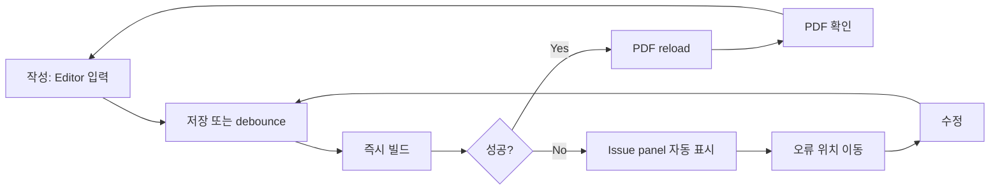

# Subagent 7: UX and Workflow Agent

## 목표

PaperForge의 macOS-native 논문 작성 workflow는 사용자가 한 창 안에서 소스, 프로젝트 구조, 빌드 상태, PDF 결과를 잃지 않고 반복 작업하도록 설계한다. 핵심 루프는 `작성 -> 즉시 빌드 -> 오류 위치 이동 -> PDF 확인`이며, 모든 주요 UI는 이 루프를 방해하지 않는 방향으로 배치한다.

PaperForge는 범용 코드 에디터보다 논문 작성에 특화된 작업대에 가깝다. 사용자는 프로젝트 파일을 찾고, `.tex`를 편집하고, 빌드하고, 오류를 고치고, PDF에서 결과를 확인하는 일을 가장 자주 한다. 따라서 MVP UX는 많은 패널과 모드를 제공하기보다 이 루프의 이동 비용을 줄이는 데 집중한다.

## UX 원칙

- 한 창에서 완료: 기본 작업은 단일 main window 안에서 끝난다.
- 소스와 결과의 동시성: editor와 PDF viewer는 같은 document context를 공유하고, 사용자가 위치를 잃지 않게 한다.
- 오류 우선 복구: 빌드 실패 시 긴 로그보다 issue, source location, suggested action을 먼저 보여준다.
- macOS 표준성: toolbar, sidebar, tab, command shortcut, preferences, recent projects는 사용자가 예상하는 macOS 패턴을 따른다.
- 초보자와 숙련자 공존: 기본값은 자동 빌드와 간단한 오류 표시이며, 숙련자는 shortcut, command palette, build profile, split layout으로 빠르게 움직인다.
- 상태 보존: 프로젝트별 열린 파일, split 비율, PDF page/zoom, issue filter, build profile을 복원한다.

## Main Window Layout

### 기본 3-pane 구조

```text
+--------------------------------------------------------------------------------+
| Toolbar: Sidebar | Project | Tabs | Build | Status | Search | Inspector/PDF     |
+------------------+-----------------------------+-------------------------------+
| Project Sidebar  | Editor Tabs                 | PDF Viewer                    |
|                  |-----------------------------|                               |
| Files            | Source Editor               | PDF toolbar                   |
| Outline          |                             |                               |
| Symbols          |                             | Rendered document             |
|                  |                             |                               |
+------------------+-----------------------------+-------------------------------+
| Issue Panel: Errors | Warnings | Logs | Build Progress | Quick Fix              |
+--------------------------------------------------------------------------------+
```

기본 상태는 왼쪽 project sidebar, 가운데 editor, 오른쪽 PDF viewer, 하단 issue panel의 조합이다. issue panel은 빌드 성공 시 접힌 상태를 기본으로 하며, 오류 발생 시 자동으로 열린다. 좁은 화면에서는 PDF viewer를 오른쪽 pane 대신 editor 아래 split로 전환할 수 있다.

### 영역별 책임

| 영역 | 기본 위치 | 책임 | 표시 조건 |
| --- | --- | --- | --- |
| Project Sidebar | 좌측 | 파일 트리, 프로젝트 아웃라인, label/citation/figure 탐색 | 항상 가능, `Cmd+0`으로 토글 |
| Editor | 중앙 | `.tex`, `.bib`, `.cls`, `.sty` 편집 | 항상 주요 focus |
| PDF Viewer | 우측 또는 하단 | 빌드 결과 확인, page/zoom/search, source sync | PDF 산출물 존재 시 |
| Issue Panel | 하단 | 오류/경고/로그/빌드 진행 상태 | 빌드 중 또는 issue 존재 시 |
| Toolbar | 상단 | 전역 navigation, build, layout, status | 항상 표시 |
| Tab Bar | editor 상단 | 열린 파일 전환, dirty state 표시 | 열린 파일 2개 이상 또는 설정에 따라 항상 표시 |

### Layout Modes

| Mode | 설명 | 주요 사용 상황 |
| --- | --- | --- |
| Editor + PDF | 중앙 editor, 우측 PDF viewer | 기본 논문 작성 루프 |
| Editor Focus | editor만 넓게 표시, sidebar/PDF/issue 접힘 | 긴 문단 작성, 수식 편집 |
| Review Split | 좌측 editor, 우측 PDF, 하단 issue 고정 | 오류 수정과 PDF 확인 반복 |
| Issue Triage | editor 위주, 하단 issue panel 확대 | 빌드 실패가 많을 때 |
| PDF Focus | PDF viewer 확대, editor는 보조 pane | 최종 검토, 레이아웃 확인 |

각 mode는 toolbar의 layout segmented control과 shortcut으로 전환한다. 창 크기와 마지막 프로젝트 상태에 따라 mode를 복원하되, 앱 최초 실행은 `Editor + PDF`로 시작한다.

## Toolbar

### Toolbar 구성

| 그룹 | 항목 | 동작 |
| --- | --- | --- |
| Navigation | sidebar toggle, back/forward | 프로젝트 탐색과 jump history 이동 |
| Project | project name, root file selector | 현재 프로젝트와 빌드 root 확인 |
| Editor | tab overview, split editor | 열린 파일과 editor split 관리 |
| Build | build button, stop button, auto-build toggle | 수동 빌드, 빌드 취소, 저장 후 자동 빌드 |
| Status | build result badge, issue count, engine | 성공/실패/진행 상태와 빌드 엔진 표시 |
| PDF | viewer toggle, sync button, zoom quick menu | PDF 표시와 source-to-PDF 이동 |
| Search | project search, PDF search | focus context에 따라 검색 대상 전환 |
| Preferences | build/profile menu | 프로젝트 설정과 앱 설정 진입 |

### Build Button 상태

| 상태 | 표시 | 클릭 동작 |
| --- | --- | --- |
| Idle | `Build` | 현재 root file 빌드 시작 |
| Building | `Stop` 또는 progress spinner | 현재 빌드 취소 |
| Success | green check + elapsed time | 다시 빌드 |
| Failed | red issue count | issue panel 열기, 첫 오류 선택 |
| Stale PDF | yellow dot | 변경 사항 빌드 |
| Missing Toolchain | warning badge | Toolchain preferences 열기 |

Build button은 toolbar에서 가장 시각적으로 찾기 쉬운 primary action이어야 한다. 단, macOS toolbar 안에서 과도한 색 면적을 쓰기보다 icon, label, status badge를 조합한다.

## Navigation Model

### Project Sidebar

Project sidebar는 하나의 sidebar 안에서 세 가지 tab 또는 segmented view를 제공한다.

| View | 내용 | MVP 여부 |
| --- | --- | --- |
| Files | 프로젝트 파일 트리, dirty/build artifact 표시 | MVP |
| Outline | `section`, `subsection`, `label`, `figure`, `table` | MVP |
| References | citation key, bibliography entries, missing references | Beta |

파일 트리는 논문 작성에 필요한 파일을 우선 보여준다. `.tex`, `.bib`, 이미지, `.sty`, `.cls`는 기본 표시하고, auxiliary/build output은 접힌 그룹이나 설정에 따라 숨긴다.

### Tabs

- Editor tab은 파일 단위로 열린다.
- Dirty tab은 macOS 관례에 맞춰 dot indicator를 표시한다.
- `Cmd+Shift+]`, `Cmd+Shift+[`로 다음/이전 tab으로 이동한다.
- tab close 시 unsaved change가 있으면 표준 sheet confirmation을 띄운다.
- 동일 파일은 중복 tab으로 열지 않고 기존 tab으로 focus한다.

### Split View

PaperForge의 split은 두 종류로 구분한다.

| Split | 설명 | MVP 여부 |
| --- | --- | --- |
| Source/PDF Split | editor와 PDF viewer를 나란히 또는 위아래로 배치 | MVP |
| Editor Split | 같은 프로젝트 안에서 두 소스 파일을 동시에 편집 | Beta |

MVP에서는 Source/PDF split이 핵심이다. Editor split은 구조적으로 여지를 두되, 초기 구현은 단일 editor column과 PDF pane에 집중한다.

### Jump History

사용자는 issue 클릭, outline 클릭, citation/reference jump, PDF sync로 자주 위치를 이동한다. PaperForge는 source location 기반 jump history를 유지한다.

- `Cmd+[` : 이전 위치로 이동
- `Cmd+]` : 다음 위치로 이동
- issue에서 source로 이동해도 history에 기록
- PDF에서 inverse search로 source 이동 시에도 history에 기록
- 파일 삭제 또는 이동으로 location이 무효화되면 가장 가까운 열린 위치로 fallback

## Core Workflow

### 작성 -> 즉시 빌드 -> 오류 위치 이동 -> PDF 확인



### 자동 빌드 규칙

- 기본값은 저장 시 자동 빌드이다.
- 사용자가 입력을 멈춘 뒤 debounce 자동 빌드는 MVP에서는 옵션으로 제공한다.
- 이전 빌드가 진행 중이면 새 변경 사항은 pending build로 큐에 넣고, 현재 빌드를 취소할지 완료 후 재빌드할지 설정에 따른다.
- 빌드 실패 상태에서 사용자가 오류 위치를 수정하고 저장하면 issue panel은 유지하되 새 빌드 결과로 교체한다.
- 빌드 성공 시 issue panel은 자동으로 접되, 사용자가 직접 고정한 경우 유지한다.

## Error Fixing Workflow

### Issue Panel 구조

```text
Issue Panel
  Filter: All | Errors | Warnings | Overfull | Logs
  Summary: 3 errors, 5 warnings, last build 1.8s
  List:
    [Error] main.tex:42 Missing $ inserted
            수식 모드 밖에서 수식 명령이 사용된 것 같습니다.
            Action: line 42로 이동 | raw log 보기 | 무시
  Detail:
    설명 / 관련 소스 미리보기 / 원문 로그 / Quick Fix
```

### Issue 항목 표시 우선순위

| 우선순위 | 표시 내용 |
| --- | --- |
| 1 | severity, file, line, short message |
| 2 | 사용자 친화 설명 |
| 3 | 추천 행동 또는 Quick Fix |
| 4 | 원문 log excerpt |
| 5 | 관련 경고, 중복 로그 묶음 |

### 오류 수정 단계

1. 빌드 실패 시 issue panel을 열고 첫 번째 error를 자동 선택한다.
2. 선택된 issue의 source location으로 editor cursor를 이동한다.
3. editor는 해당 줄을 강조하고, gutter에 error marker를 표시한다.
4. issue detail은 짧은 설명, 관련 log, 가능한 Quick Fix를 보여준다.
5. 사용자가 수정 후 저장하면 자동 빌드가 시작된다.
6. 같은 issue가 사라지면 다음 issue로 이동하거나 PDF viewer를 갱신한다.
7. 모든 error가 사라지면 PDF viewer가 앞으로 오고, build status가 success로 바뀐다.

### Source Location 이동 규칙

- line/column이 있으면 정확한 위치로 이동한다.
- line만 있으면 해당 줄 첫 non-whitespace 문자로 이동한다.
- 로그의 파일 경로가 included file이면 해당 파일 tab을 연다.
- 경로를 찾을 수 없으면 root file과 raw log를 함께 보여준다.
- issue가 여러 후보 위치를 가지면 가장 구체적인 위치를 기본 선택하고, detail에서 후보를 전환할 수 있다.

### Quick Fix MVP 범위

MVP는 자동 수정보다 안전한 안내를 우선한다.

| 유형 | MVP 동작 |
| --- | --- |
| Missing file | 파일 경로 후보 표시, Finder에서 위치 보기 |
| Undefined citation/reference | 후보 key 검색, `.bib` 또는 label 위치 열기 |
| Missing package | package name 강조, preamble 위치로 이동 |
| Unclosed environment | begin/end 후보 위치 표시 |
| Syntax around line | 해당 줄과 앞뒤 3줄 context 표시 |

자동 diff 적용은 v1.0 이후로 미룬다. MVP에서는 사용자가 소스 위치를 빠르게 찾는 경험이 더 중요하다.

## PDF Viewer Workflow

### Build 성공 후 PDF 갱신

- PDF viewer는 빌드 성공 이벤트를 받으면 산출물 경로를 reload한다.
- reload 전 page, zoom, scroll anchor를 저장하고 복원한다.
- PDF가 아직 없거나 빌드 실패 시 마지막 성공 PDF를 유지하고, toolbar에 stale badge를 표시한다.
- PDF viewer가 숨겨져 있어도 빌드 결과는 준비해두고, 다시 열 때 즉시 표시한다.

### Source/PDF Sync

| 기능 | MVP | Beta |
| --- | --- | --- |
| Issue -> Source | 포함 | 포함 |
| Source -> PDF forward search | 기본 지원 목표 | 안정화 |
| PDF -> Source inverse search | 제외 | 포함 |
| SyncTeX 진단 UI | 최소 경고 | 상세 진단 |

MVP에서 source-to-PDF가 실패하면 조용히 무시하지 않고 `Sync unavailable` 상태를 보여준다. 단, 사용자의 작성 흐름을 막는 modal error는 띄우지 않는다.

## Recent Projects and Start Flow

### 앱 시작 상태

열린 프로젝트가 없으면 lightweight start window를 보여준다.

| 영역 | 내용 |
| --- | --- |
| Recent Projects | 최근 프로젝트 이름, 경로, 마지막 열림 시간, missing badge |
| Primary Actions | Open Project, Open `.tex`, New from Template |
| Toolchain Status | TeX Live/MacTeX 감지 상태, Preferences 진입 |
| Restore | 마지막 세션 복원 |

Start window는 marketing page가 아니라 작업 진입 화면이다. 최근 프로젝트를 선택하면 즉시 main window가 열리고, 마지막 layout과 열린 tab을 복원한다.

### Recent Projects 규칙

- 프로젝트 폴더 기준으로 저장한다.
- root file, 마지막 build profile, window layout, 열린 tab 목록을 함께 저장한다.
- iCloud Drive 또는 외장 디스크 경로가 사라진 경우 missing badge를 표시하고 재연결할 수 있게 한다.
- `File > Open Recent`와 start window 목록은 같은 store를 사용한다.

## Preferences Screen Structure

Preferences는 macOS 표준 settings window로 제공하며, app-wide 설정과 project-specific 설정을 명확히 분리한다.

### Preferences Navigation

| Tab | 주요 설정 | MVP 여부 |
| --- | --- | --- |
| General | startup behavior, recent projects, restore windows, appearance | MVP |
| Editor | font, line numbers, soft wrap, autosave, snippets | MVP |
| Build | TeX toolchain path, default engine, auto-build, output directory | MVP |
| PDF | default zoom, page layout, reload behavior, sync behavior | MVP |
| Issues | warning visibility, log verbosity, issue grouping | MVP |
| Projects | default root detection, ignored files, build artifact hiding | Beta |
| Advanced | environment variables, shell escape policy, diagnostic export | Beta |

### General

- 시작 시 마지막 프로젝트 복원 여부
- start window 표시 여부
- 최근 프로젝트 최대 개수
- appearance: system/light/dark
- crash recovery 문서 복원

### Editor

- editor font family/size
- line numbers 표시
- current line highlight
- soft wrap
- tab width, indentation
- 자동 저장
- LaTeX environment auto-pair
- citation/reference completion enable

### Build

- TeX distribution 자동 감지 상태
- `latexmk`, `pdflatex`, `xelatex`, `lualatex`, `biber`, `bibtex` 경로
- 기본 엔진
- 저장 시 자동 빌드
- debounce build 사용 여부
- output/aux directory strategy
- SyncTeX 생성 여부
- shell escape policy: disabled by default, project opt-in

### PDF

- 기본 display mode: single continuous, two-up 등
- 기본 zoom: fit width, fit page, last used
- reload 시 page/zoom 유지
- 마지막 성공 PDF 유지 여부
- source-to-PDF sync trigger
- PDF background와 dark mode behavior

### Issues

- 빌드 실패 시 issue panel 자동 열기
- 성공 시 issue panel 자동 접기
- warning 표시 기본값
- overfull/underfull box 분류
- raw log 기본 접힘 여부
- issue grouping strategy

### Project-specific Settings

프로젝트별 설정은 main window toolbar의 project menu 또는 `Project Settings...`에서 연다.

| 설정 | 설명 |
| --- | --- |
| Root file | 프로젝트의 main `.tex` |
| Build profile | engine, latexmk/direct, bibliography tool |
| Output directory | `.paperforge-build` 또는 custom |
| Auto-build override | 앱 기본값과 다르게 설정 |
| Ignored paths | sidebar/index/build에서 제외할 경로 |
| Shell escape | 프로젝트 단위 명시 허용 |

프로젝트 설정은 `.paperforge/project.json` 같은 명시 파일 또는 Application Support의 workspace metadata에 저장할 수 있다. MVP에서는 사용자 프로젝트에 파일을 쓰지 않는 Application Support 저장을 기본으로 두고, exportable project config는 Beta에서 검토한다.

## Keyboard Shortcut Table

| Shortcut | Command | 설명 |
| --- | --- | --- |
| `Cmd+O` | Open Project/File | 프로젝트 또는 `.tex` 파일 열기 |
| `Cmd+Shift+O` | Open Quickly | 프로젝트 파일 빠른 검색 |
| `Cmd+N` | New File | 현재 프로젝트에 새 파일 생성 |
| `Cmd+S` | Save | 현재 파일 저장 |
| `Cmd+Option+S` | Save All | 열린 파일 모두 저장 |
| `Cmd+B` | Build | 현재 root file 빌드 |
| `Cmd+.` | Stop Build | 실행 중인 빌드 취소 |
| `Cmd+R` | Rebuild | clean 없이 재빌드 |
| `Cmd+Shift+K` | Clean Build Artifacts | build artifact 정리 |
| `Cmd+0` | Toggle Sidebar | project sidebar 표시/숨김 |
| `Cmd+1` | Focus Editor | editor focus |
| `Cmd+2` | Focus PDF | PDF viewer focus |
| `Cmd+3` | Focus Issues | issue panel focus |
| `Cmd+Option+P` | Toggle PDF Viewer | PDF pane 표시/숨김 |
| `Cmd+Option+I` | Toggle Issue Panel | issue panel 표시/숨김 |
| `Cmd+Shift+]` | Next Tab | 다음 editor tab |
| `Cmd+Shift+[` | Previous Tab | 이전 editor tab |
| `Cmd+[` | Back | 이전 source/navigation location |
| `Cmd+]` | Forward | 다음 source/navigation location |
| `Cmd+F` | Find | 현재 focus 영역 검색 |
| `Cmd+Shift+F` | Find in Project | 프로젝트 전체 검색 |
| `Cmd+L` | Go to Line | 줄 번호로 이동 |
| `Cmd+Option+J` | Jump to PDF | 현재 source 위치에서 PDF 위치로 이동 |
| `Cmd+Option+Click` | Inverse Search | PDF 위치에서 source로 이동, Beta |
| `Cmd+,` | Preferences | 앱 설정 열기 |
| `Cmd+Shift+,` | Project Settings | 프로젝트 설정 열기 |
| `Cmd+Shift+P` | Command Palette | 명령 검색, Beta |

Shortcut은 macOS 표준과 충돌하지 않는 범위에서 정의한다. 실제 구현 시 menu command와 toolbar action은 같은 command router를 사용해야 한다.

## MVP UX Acceptance Criteria

### Main Window

- 사용자는 하나의 main window에서 project sidebar, editor, PDF viewer, issue panel을 모두 사용할 수 있다.
- sidebar, PDF viewer, issue panel은 각각 keyboard shortcut과 toolbar control로 표시/숨김이 가능하다.
- 마지막 window size, split ratio, visible panes, 열린 tab이 프로젝트별로 복원된다.
- PDF viewer가 없는 첫 빌드 전 상태에서도 editor 중심 작업이 어색하지 않다.

### Writing and Build Loop

- 사용자는 `.tex` 파일을 수정하고 `Cmd+S` 또는 `Cmd+B`로 2초 이내에 빌드 상태 변화를 인지할 수 있다.
- 빌드 중에는 progress, 취소 액션, 현재 root file이 명확히 표시된다.
- 빌드 성공 시 PDF viewer가 자동 갱신되고 page/zoom이 유지된다.
- 빌드 실패 시 issue panel이 열리고 첫 번째 error 위치로 이동할 수 있다.

### Error Fixing

- issue list의 각 항목은 severity, file, line, short message를 한눈에 보여준다.
- issue 클릭 시 관련 source file이 열리고 해당 줄이 강조된다.
- 원문 log는 볼 수 있지만 기본 정보 구조를 압도하지 않는다.
- 오류 수정 후 저장하면 새 빌드 결과가 기존 issue 목록을 대체한다.
- 위치를 찾을 수 없는 issue도 raw log와 root file context를 통해 복구 가능한 상태로 표시된다.

### Navigation

- project file tree에서 파일을 열면 editor tab으로 열린다.
- outline에서 section/label/figure/table을 선택하면 source 위치로 이동한다.
- jump history가 issue navigation과 outline navigation에서 동작한다.
- `Cmd+Shift+O`로 프로젝트 파일을 빠르게 열 수 있다.

### Preferences and Recent Projects

- `Cmd+,`로 Preferences를 열 수 있고, MVP 필수 설정이 General, Editor, Build, PDF, Issues에 나뉘어 있다.
- TeX toolchain이 없거나 감지되지 않으면 Preferences의 Build tab으로 이동할 수 있는 안내가 표시된다.
- start window와 `File > Open Recent`는 같은 recent project 목록을 보여준다.
- missing project는 목록에서 구분되며 사용자가 재연결하거나 제거할 수 있다.

### macOS Native Quality

- toolbar, sidebar, tab, settings window, sheet confirmation은 macOS 표준 동작을 따른다.
- light/dark mode에서 editor, issue panel, PDF viewer chrome이 모두 읽기 쉽다.
- 모든 주요 명령은 menu bar command로도 접근 가능하다.
- 앱 종료/재시작 후 사용자가 작업하던 프로젝트와 위치를 복원한다.

## MVP 제외 항목

- 완전한 editor split 다중 column
- PDF inverse search의 안정화된 전체 경험
- AI 기반 자동 diff 수정
- 협업 comment/review workflow
- journal submission package wizard
- bibliography manager 전체 기능

MVP는 많은 기능을 넓게 제공하기보다, 한 창에서 빠르게 작성하고 빌드 실패를 고쳐 PDF를 확인하는 반복 경험을 완성하는 데 집중한다.
